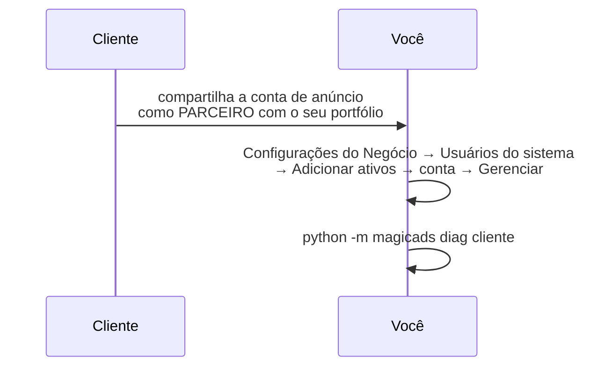

# 2. O token que não expira

> Token de usuário pessoal morre. Morre quando você troca a senha, quando desloga,
> quando a Meta resolve, e sempre às 3 da manhã do dia do relatório.
> O que sustenta automação é **System User**.

## Por que System User e não o seu login

| | Token de usuário | System User |
|---|---|---|
| Expira | sim, e sem aviso | **"Nunca"**, se você marcar |
| Morre quando troca a senha | sim | não |
| Some quando você sai da empresa | sim | não |
| Serve pra cron | não | sim |

## Passo a passo

1. **Configurações do Negócio** → **Usuários** → **Usuários do sistema** → **Adicionar**
   Nome sugerido: `marketing-api`. Tipo: **Administrador**.

2. **Adicionar ativos** ao System User:
   - o **app** que você criou
   - as **contas de anúncio** que vai operar, com tarefa **Gerenciar**
   - as **Páginas**, se for mexer com mensagem ou lead

3. **Gerar novo token** → escolha o app → marque os escopos:

   | Escopo | Pra quê | Precisa de verificação? |
   |---|---|---|
   | `ads_management` | criar, editar e **ler insights** | não |
   | `business_management` | ler portfólio, páginas, ativos | não |
   | `ads_read` | leitura (redundante com `ads_management`) | sim, e você já tem o que ele dá |
   | `leads_retrieval` | puxar lead de formulário | **sim** |
   | `pages_read_engagement`, `pages_show_list` | páginas | depende do uso |

   Para começar: **`ads_management` + `business_management`** resolvem.

4. **Expiração: "Nunca"**. É a caixa que a maioria esquece.

5. **App Secret Proof** (Configurações Avançadas do app): ligue. Passa a exigir `appsecret_proof` nas chamadas de servidor, o que torna o token roubado inútil sem o secret.

## A conta é do cliente: o que ele precisa fazer

Você não consegue se atribuir a conta de outra pessoa. A ordem é:



O cliente mantém o portfólio dele. Você não precisa (nem deve) pedir para ele mover a conta para o seu. Compartilhamento de parceiro resolve, e mantém você em Standard Access.

## Guardando o token

```bash
mkdir -p ~/.magicads/tokens
printf 'ACME_META_TOKEN=EAA...\n' > ~/.magicads/tokens/acme.env
chmod 600 ~/.magicads/tokens/acme.env
```

Três regras, e todas nasceram de erro real:

1. **Um arquivo por cliente.** Vazar um não pode ser vazar todos.
2. **`chmod 600`.** O CLI avisa quando não está.
3. **Nunca em pasta compartilhada** (`~/workspace`, Drive sincronizado, repositório). Costuma ser legível pelo grupo, e uma vez que entra no histórico do git, sai só reescrevendo história.

O CLI aceita qualquer prefixo, desde que a chave **termine em `_META_TOKEN`**.

## Testando

```bash
python -m magicads clientes
```

Saída boa:

```
  OK acme                   Nome Da Empresa 1784...  |  3 conta(s): Acme BR, Acme SP, Acme Teste
```

Saída ruim, e o que ela quer dizer:

| O que aparece | Causa |
|---|---|
| `TOKEN MORTO code=190` sozinho | senha trocada do lado do cliente |
| `TOKEN MORTO code=190 subcode=465` | o app saiu do portfólio. **Readicionar não basta: tem que gerar token novo** |
| `OK` mas `0 conta(s)` | o token abre, mas nenhuma conta foi **atribuída ao System User**. Faltou o passo 2 |

## Quando dois tokens veem coisas diferentes

Acontece direto em operação de agência: o seu token lê uma conta pela metade porque ela não está no seu portfólio, enquanto o token do System User **do cliente** lê inteira. A API não te avisa disso. Ela devolve **lista vazia com HTTP 200**.

Por isso o cofre é por cliente: quando a leitura vier estranha, você troca a identidade e compara. `diag` nos dois e a diferença aparece.

Próximo: `python -m magicads diag <cliente>` e [`docs/03-dia-a-dia.md`](03-dia-a-dia.md).
