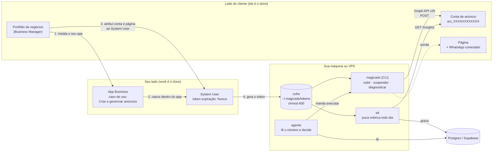
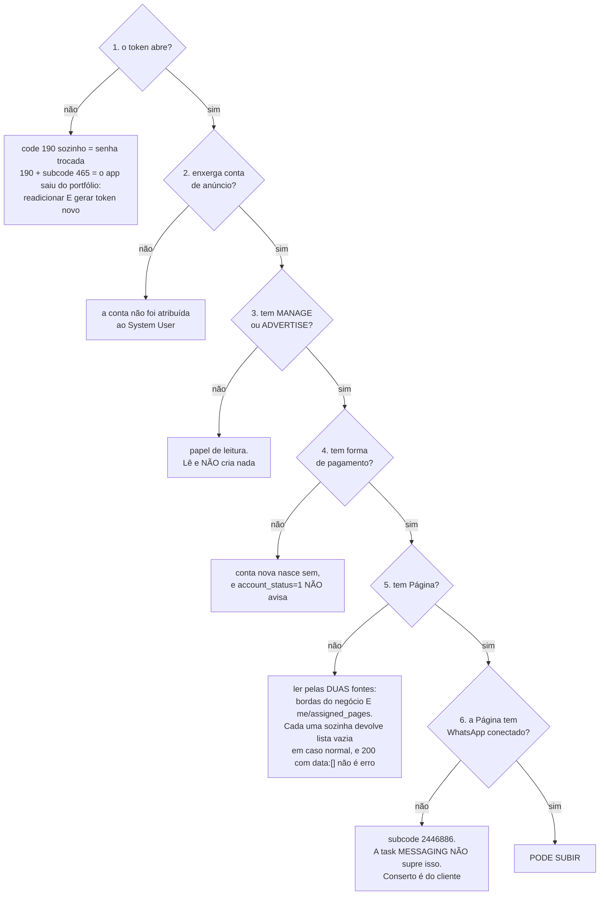
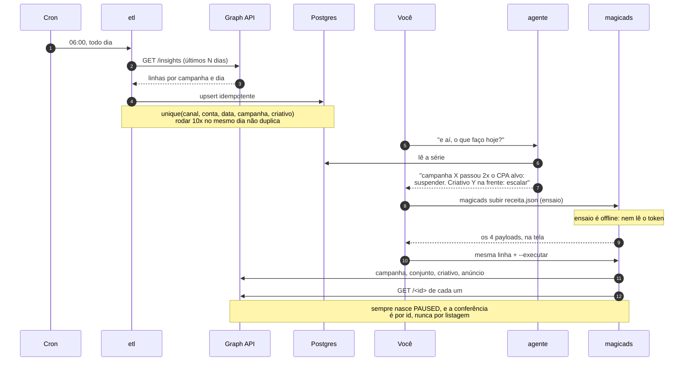
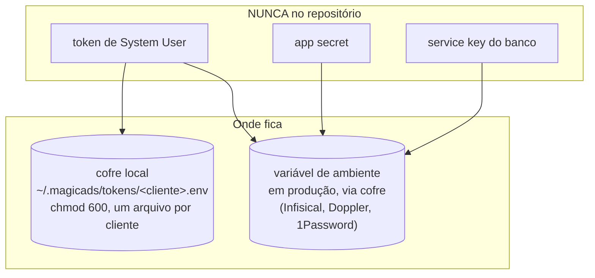
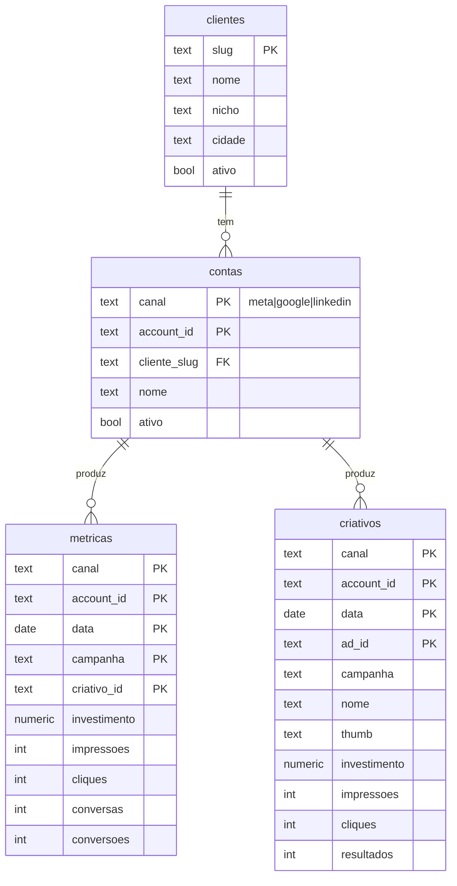

# Arquitetura: o que conecta onde

> Este é o documento que responde "de onde sai o dado, por onde passa e quem manda".
> Se você só vai ler um arquivo deste repo, leia este.

---

## 1. O mapa de ligação

O ponto que quase todo mundo erra: **o app é seu, a conta de anúncio é do cliente, e o que costura os dois é o System User**. Não é login, não é senha, não é sessão de navegador.

**A regra que destrava tudo:** enquanto o System User tiver o ativo atribuído, você está em **Standard Access**, que é auto-aprovado. Advanced Access e App Review só entram quando o app acessa dado de gente que **não tem papel nele** (o caso de um SaaS público com login de terceiro). Agência que opera conta atribuída não cai nesse caso.

---

## 2. Onde conectar o quê (tabela de decisão)

| O que você quer | Onde se conecta | Quem é o dono da ação |
|---|---|---|
| Criar o app | developers.facebook.com, no **seu** portfólio | você |
| Escolher o caso de uso | tela "Adicionar casos de uso" | você. **Marque só "Criar e gerenciar anúncios com a API de Marketing"** |
| Criar o System User | Configurações do Negócio → Usuários → Usuários do sistema | você |
| Dar acesso à conta do cliente | o cliente compartilha a conta como **parceiro** com o seu portfólio | **o cliente** |
| Atribuir o ativo ao System User | Configurações do Negócio → Usuários do sistema → Adicionar ativos | você |
| Conectar WhatsApp na Página | Business Suite → Configurações da Página → WhatsApp | **o cliente**, e não tem atalho |
| Guardar o token | cofre local, arquivo por cliente, `chmod 600` | você |
| Ler métrica todo dia | `etl` → Postgres | automático (cron) |

> Metade dos travamentos não é técnica: é ação que **só o cliente pode fazer** e que ninguém pediu pra ele. O `magicads diag` existe pra dizer exatamente qual das duas é.

---

## 3. Os 6 portões (o que o `diag` testa)

Subir campanha falha por seis motivos, e cinco deles não aparecem em lugar nenhum antes de você tentar.

**O portão 6 é o mais traiçoeiro e a razão da sonda existir.** Nenhuma leitura da API revela se a Página tem número de WhatsApp conectado. Quem responde é o `POST` de conjunto com destino `WHATSAPP`, que devolve o subcode `2446886`. Por isso o `diag` dispara esse POST com `execution_options=["validate_only"]`: a Meta confere e **não cria**.

⚠️ **`validate_only` funciona em conjunto e anúncio, e NÃO protege em `/campaigns`** (lá ele cria de verdade). É por isso que a sonda é um adset pendurado numa campanha que já existe, e nunca uma campanha nova.

---

## 4. O ciclo do dia

**Por que o número vem do banco e não do chat:** métrica lida na conversa é métrica que você não consegue comparar com ontem. O banco existe pra ter série, não pra ter dashboard.

---

## 5. Por que isso ganha do MCP oficial

A Meta abriu os Ads AI Connectors em 29/04/2026: MCP em `mcp.facebook.com/ads` com 29 ferramentas. É ótimo pra perguntar coisa no chat. Não é o que roda uma operação.

| | MCP oficial | App próprio + System User |
|---|---|---|
| Roda em cron, sem ninguém na frente | **não.** É sessão de chat | sim |
| Custo de contexto | ~134k tokens só pra carregar as 29 definições | zero |
| Quem monta o payload | o modelo | você, e o campo é sempre o mesmo |
| Custom Audiences e Lookalike | **não cobre** | cobre |
| Identidade | a de quem conectou | a do System User que você escolher |
| Quando a conta não está no seu portfólio | lê pela metade e às vezes **devolve lista vazia no lugar de erro** | o token certo enxerga, e o `diag` prova qual é |

A última linha é a mais importante em operação de agência: **lista vazia com HTTP 200 não é "não tem", é "não vejo"**. Conferir sempre por `GET /<id>` direto, nunca pela listagem.

---

## 6. Onde mora cada segredo

Regras que o código já aplica sozinho:

1. **O token nunca é impresso.** Existe um filtro na saída que troca o valor por `<SEGREDO>`, inclusive dentro de mensagem de erro. Erro da Meta ecoa parâmetro, e é assim que token vaza em log.
2. **Um arquivo por cliente**, não um `.env` gigante. Perder um não é perder todos.
3. **`chmod 600`**, e o CLI avisa quando não está.
4. **Nada de token em `~/workspace` ou pasta compartilhada:** aquilo costuma ser legível pelo grupo.

---

## 7. O banco (versão simplificada)

O schema completo de um painel multi-cliente com login tem umas 12 tabelas, views de portfólio, RLS por tenant, log de acesso e trilha de encerramento. **Isso existe porque o cliente entra e vê o dado dele.**

O MagicAds v1 é do **operador**. Então são **4 tabelas, e nenhuma view**:

**O que foi cortado de propósito, e por quê:**

| Cortado | Por quê |
|---|---|
| RLS e `tenant_id` em tudo | não tem cliente logado. A coluna `cliente_slug` já está lá se um dia tiver |
| Tabelas de GBP, Instagram e LinkedIn | v1 é Meta e Google. Mesmo formato, é só somar canal |
| Views de portfólio, score, saúde | cabem numa query. View vira dívida cedo demais |
| Log de acesso, auditoria, encerramento | existem por causa de cliente logado e LGPD de painel |

**A chave que faz o ETL ser idempotente** é o `unique(canal, account_id, data, campanha, criativo_id)`. Com ela, rodar o ETL dez vezes no mesmo dia não duplica nada, e não precisa de controle de "já rodei hoje".

---

## 8. Ordem de instalação

Fazer fora de ordem é o que gera aquele dia inteiro perdido:

1. **App Meta** com o caso de uso certo → `docs/01-app-meta.md`
2. **System User + token** e os ativos atribuídos → `docs/02-token.md`
3. **`magicads diag <cliente>`** até dar `PODE SUBIR`. Não pule: é aqui que se descobre o que é problema do cliente
4. **Banco** (`db/schema.sql`) e o ETL
5. **Agente**, que só faz sentido quando já existe série no banco
